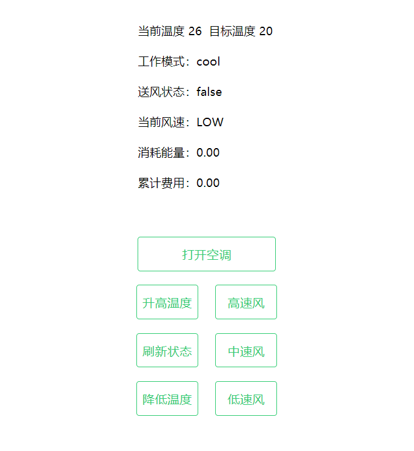
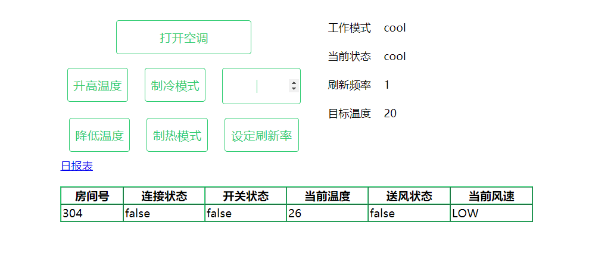

### 项目说明

某快捷廉价酒店响应节能绿色环保理念，推行自助计费式中央温控系统，使得入住的客户可以根据要求设定温度和风速的调节，同时可以显示所消耗的能量以及所需支付的金额。除此之外，酒店针对每个房间需要给出空调使用的详单，方便客户退房时进行结账，以及酒店空调使用的各式统计报表。

详细说明可以看文档。

### 项目结构

使用Python，Django作为服务器。

网页和服务器通信，通过Ajax实现。

### 网页截图

### 贡献

负责前端网页实现，web服务器搭建。（MVC中的VC）

